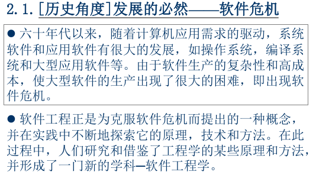

第一次作业 (对应 *lesson1.html*)
============

---

### 1、简单题

0. 软件工程的定义
    - 按老师给的课件上的定义:
        
        *这也是 IEEE 的定义*
    - 按维基百科的定义:
        
        
0. 阅读经典名著“人月神话”等资料，解释 software crisis、COCOMO 模型。
    - `software crisis`
        - 按老师给的课件上的解释:
           
        - 按维基百科的解释:
           
    - `COCOMO`
        - 按维基百科的解释:
            
        - 具体参见其维基词条:
            - [COCOMO](https://en.wikipedia.org/wiki/COCOMO)
            - [构造性成本模型](https://zh.wikipedia.org/wiki/构造性成本模型)
        - 人月神话一书中, 作业也曾提及这套模型的一个成果:
            
            *值得注意的是, 图中提及的 IBM 360系统, 恰也被认为是 `software crisis` 的一个典型案例 ...*
0. 软件生命周期。
    - 按老师给的课件上的解释:
        
    - 按维基百科的解释:
        
    - 具体可参见其相关维基词条:
        - [软件开发过程](https://zh.wikipedia.org/wiki/软件开发过程)
        - [Software Development Life Cycle (SDLC), i.e. software development process](https://en.wikipedia.org/wiki/Software_development_process)
        - [软件生命周期管理](https://zh.wikipedia.org/wiki/%E8%BB%9F%E9%AB%94%E7%94%9F%E5%91%BD%E9%80%B1%E6%9C%9F%E7%AE%A1%E7%90%86)
0. 按照 SWEBok 的 KA 划分，本课程关注哪些 KA 或 知识领域？
    以 [SWEBOK Version 3](https://en.wikipedia.org/wiki/Software_Engineering_Body_of_Knowledge#SWEBOK_Version_3) 为准, 我认为本课程主要关注:
    - Software requirements (我对此的理解是 软件需求相关的分析/设计/表达/管理等)
    - Software engineering process (也即, 与 SDLC 相关)
    - Software engineering models and methods
    - Software quality
0. 解释 CMMI 的五个级别。例如：Level 1 - Initial：无序，自发生产模式。
    - 按维基百科的解释:
        
    - 而依照 [CMMI Institute](http://cmmiinstitute.com/capability-maturity-model-integration) :
        
    - 在百度百科上也能看到一种中文版的解释: [CMMI 的五个等级](https://baike.baidu.com/item/CMMI#5)
0. 用自己语言简述 SWEBok 或 CMMI （约200字）
    * `SWEBok`
        SWEBok, 全称 Software Engineering Body of Knowledge, 是一个 ISO 钦定的国际通用标准, 类似于一个权威指南, 其明确了整个**软件工程**领域中被广泛接受的各个主要知识领域(*knowledge area*); 比如, SWEBok version 3 就明确了如下的 15个方面:
        - Software requirements
        - Software design
        - Software construction
        - Software testing
        - Software maintenance
        - Software configuration management
        - Software engineering management
        - Software engineering process
        - Software engineering models and methods
        - Software quality
        - Software engineering professional practice
        - Software engineering economics
        - Computing foundations
        - Mathematical foundations
        - Engineering foundations
    * `CMMI`
        CMMI, 全称 Capability Maturity Model Integration, 中文译名可取 能力成熟度模型集, 是一个针对 `process` level 的改进, 训练及评估的项目, 由 CMU 主持开发并注册; CMU 声称 CMMI 可用于指导项目, 部门, 甚至一整个组织 的 过程改进工作 (并不只局限于软件工程领域); CMMI 共定义了以下的 5个级别:
        - Initial
        - Managed
        - Defined
        - Quantitatively Managed
        - and Optimizing

---

### 2、解释 PSP 各项指标及技能要求：

0. 阅读《现代软件工程》的 PSP: Personal Software Process 章节。
0. 按表格 PSP 2.1， 了解一个软件工程师在接到一个任务之后要做什么，需要哪些技能，解释你打算如何统计每项数据？
    如下图:
    

    关于统计数据的打算:

    我认为应该针对具体情况对待这个统计工作, 比如, 开发方式有很多不同的可能, 因而对于一些开发方式或许有更贴切更合适也更有针对性的统计方式;
    泛泛而谈的话, 简单的统计工作时间, 统计代码量, 统计具体完成情况, 等等应该都是可以考虑的方法;
    也许, 适当地进行权重分配, 考虑相关的影响因子(比如, 任务重要性, 对其他工作单位的影响, 对整体的影响, 对工作成果的评价, 一些硬性指标及其变化, 等等) 等也可以考虑, 但对很多规模较小的项目我还是觉得一些东西不需要太细究 ...

---

这里的文章除了特别说明为 [转载] 之外，均为本人原创，转载请说明出处。

