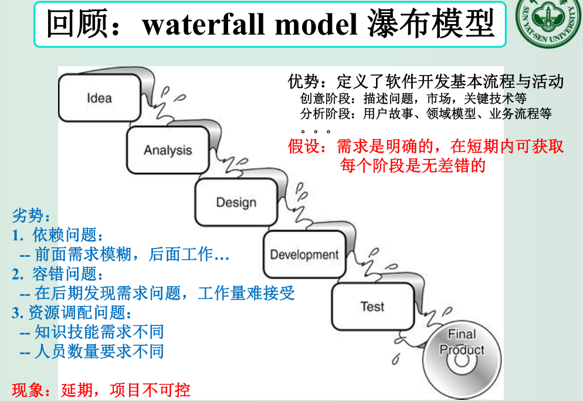
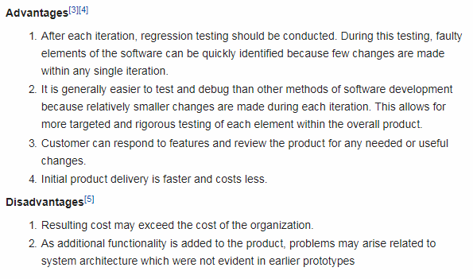
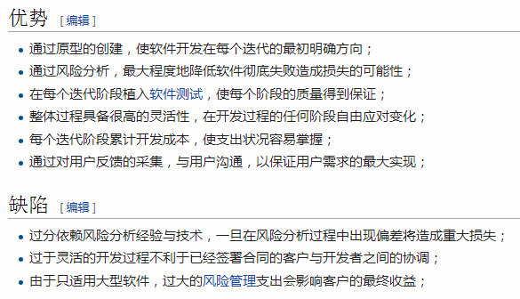
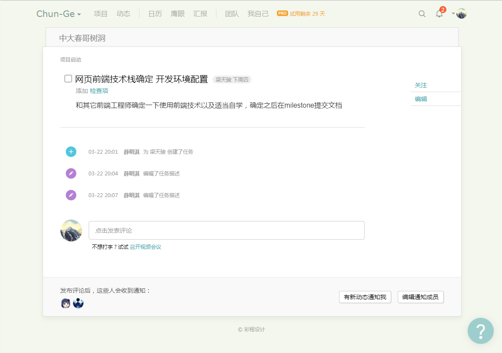

第二次作业 (对应 *lesson2.html*)
============

---

### 1、简答题

0. 简述瀑布模型、增量模型、螺旋模型（含原型方法）的优缺点。
    - `瀑布模型`:
        - 按老师给的课件上说的:
            
        - 按[维基百科](https://en.wikipedia.org/wiki/Waterfall_model)说的, 补充如下:
            * 优点:
                0. 能更早地发现问题/解决问题/作出规划等, 成本自然也更低;
                0. 往往导致项目的时间分配高度结构化并利于管理调控;
                0. 重视文档, 避免因开发人事变动等因素导致的效率降低等; (当然这点上往往有利有弊)
                0. 简单, 直观, 可套路化 ...
                0. 同样地, 需求明确稳定等的情景下自然很适合;
            * 缺点:
                0. 见上, 见下 ...
        - 另可参见百度百科: [瀑布模型优缺点](https://baike.baidu.com/item/瀑布模型#2)
    - `增量模型`:
        - 按老师给的课件上说的, 增量模型至少在一定程度上解决了 项目控制, 团队组织 等问题;
        - 按维基百科说的:
            
        - 另可参见百度百科: [增量模型优缺点](https://baike.baidu.com/item/增量模型#2)
    - `螺旋模型（含原型方法）`:
        - 按维基百科说的:
            
        - 另可参见百度百科: [螺旋模型优缺点](https://baike.baidu.com/item/螺旋模型#5)
0. 简述 UP 的三大特点，其中哪些内容体现了用户驱动的开发，哪些内容体现风险驱动的开发？
    - 按老师给的课件上的解释, UP 的三大特点为: *(注: 与 wiki 上的说法有一定出入)*
        1. Use Case Driven
        2. Architecture Centric
        3. Iterative and Evolutionary
    - 其中 **1.** 体现了用户驱动的开发, **2.** 和 **3.** 则体现风险驱动的开发;
0. UP 四个阶段的划分准则是什么？关键的里程碑是什么？
    - 按老师给的课件上说的:
        
        *因为我并不确定 划分准则 具体何意 ...*
    - 依据 [Unified Process Explained](http://www.informit.com/articles/article.aspx?p=24671&seqNum=7):
        * UP 四个阶段的划分准则 即是: 其各自的关键里程碑, 也即, 以此为分界点;
        * 其各自的关键里程碑分别为:
            0. Life-Cycle Objective Milestone
            0. Life-Cycle Architecture
            0. Initial Operational Capability
            0. Product Release
0. IT 项目管理中，“工期、质量、范围/内容” 三个元素中，在合同固定条件下，为什么说“范围/内容”是项目团队是易于控制的
    - **合同固定** 的条件下, 显然 **工期** 和 **质量** 都是约定好的了;
    - 即便 **质量** 相对的难以被客观地评定, 但显然更取决于 **客户** 而非 **项目团队** (各种意义上) ...
    - 而 **范围/内容** 相对的显然就很容易被项目团队控制了, 不论技术体系, 构建过程, 种种取舍 ... 反正是由项目团队主导的;
0. 为什么说，UP 为企业按固定节奏生产、固定周期发布软件产品提供了依据？
    - 用了迭代, 增量式的开发方式 (Iterative and Evolutionary, incremental), 且迭代周期短而固定, 管制及时, 且控制力强, 代价可控 ... ;
    - 各阶段明确, 且有里程碑作决策指导, 过程体系化标准化;

---

### 2、项目管理使用

0. 使用截图工具（png格式输出），展现你团队的任务 Kanban
    - 如图:
        
    - 地址:
        [中大春哥树洞](https://tower.im/projects/bb6d7eb9fc464d3394a8d2d2090db613/)
    - 我被分派到的分工是 **网页前端开发** 的组员, 第一周的任务是:
        
        *似乎由于 tower 的限制, 一个任务只能分配一个人, 所以只分配了组长 ...*

---

这里的文章除了特别说明为 [转载] 之外，均为本人原创，转载请说明出处。

