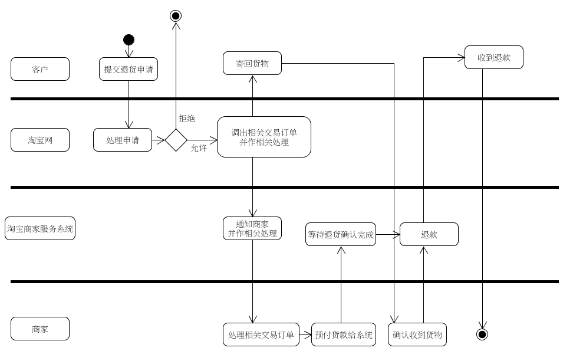

第四次作业 (对应 *lesson6.html*)
============

---

### 1、用例建模

* a. 阅读 Asg_RH 文档，绘制用例图。 按 Task1 要求，请使用工具 UMLet，截图格式务必是 png 并控制尺寸
    
* b. 选择你熟悉的定旅馆在线服务系统（或移动 APP），如绘制用例图。并满足以下要求：
    
* c. 对比两个时代、不同地区产品的用例图，总结在项目早期，发现创新的思路与方法
    - 要根据实际情况/时代趋势等有针对性地提供服务, 比如, 不同的时代/地区等可能会有不同的支付方式及习惯 ;
    - 有所取舍与平衡, 可以根据具体情况考虑提供唯一的一个还是多个操作入口, 不同的年代下不同的用户的体验都可能不一样 ;
    - 要能敏锐地发掘细节上/深层次/多元化的用户心理和用户需求 ;
    - 多多参考/研究/反思已有的项目 ;
    - 等等等等 ;
* d. 请使用 SCRUM 方法，在（任务b）用例图基础上，编制某定旅馆开发的需求 （backlog）

    | story | Est | Imp |
    | ----- | --- | --- |
    | 作为用户, 可以根据 各种因素(包括但不仅限于 时间/地点/价格/..., 下同) 搜索酒店 | 3 | 30 |
    | 作为用户, 可以根据 各种因素 对 (搜索到的/所有的/某个列表中的) 酒店进行 排序/筛选 | 3 | 30 |
    | 作为用户, 可以选择 一间酒店 以继续后续预订操作 | 5 | 40 |
    | 作为用户, (在选定了某间酒店后) 可以对 房间 就各个方面(包括但不仅限于 类型/价格/楼层/..., 下同) 进行 选择 | 4 | 30 |
    | 作为用户, 可以 确定/提交 预订订单 | 3 | 40 |
    | 作为用户, 可以 取消 订单 | 3 | 20 |
    | 作为用户, 可以选择支付方式 | 8 | 20 |
    | 作为用户, 可以进行支付 | 8 | 40 |
    | 作为未登录用户, 可以登录 | 3 | 20 |
    | .... | .... | .... |

---

### 2、业务建模

* a. 在（任务b）基础上，用活动图建模找酒店用例。简述利用流程图发现子用例的方法。
    - 活动图: 
    - 观察流程图并思考, 整个流程的每个节点往往都可以继续细化, 联系前后的依赖关系, 即可提取各子用例 ;
* b. 选择你身边的银行 ATM，用活动图描绘取款业务流程
    活动图: 
* c. 查找淘宝退货业务官方文档，使用多泳道图，表达客户、淘宝网、淘宝商家服务系统、商家等用户和系统协同完成退货业务的过程。分析客户要完成退货业务，在淘宝网上需要实现哪些系统用例
    - 
    - 淘宝网上需要实现的系统用例可能有: 接受并处理退货申请, 针对退货申请的仲裁, 对客户方的协调 等用例 ;

---

### 3、用例文本编写

* 在大作业基础上，分析三种用例文本的优点和缺点
    - Brief:
        - 优点: 编写方便, 简洁, 便于快速了解 ;
        - 缺点: 缺少细节, 只能粗略地反映用例 ;
    - Fully:
        - 优点: 详细深入, 清晰明确 ;
        - 缺点: 编写过程工作量大 ;
    - Casual:
        - 基本介乎前述两者之间 ;

---

这里的文章除了特别说明为 [转载] 之外，均为本人原创，转载请说明出处。

