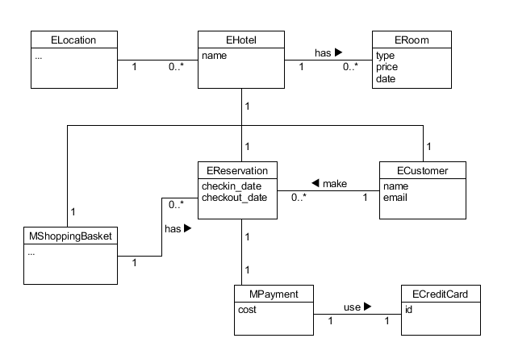
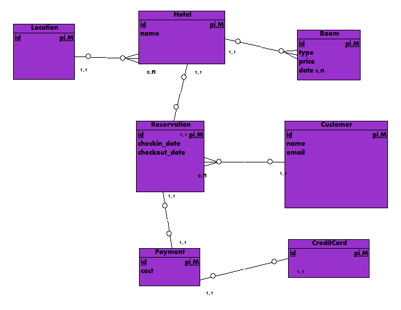

第五次作业 (对应 *lesson7.html*)
============

---

### a. 阅读 Asg_RH 文档，按用例构建领域模型。
> - 按 Task2 要求，请使用工具 UMLet，截图格式务必是 png 并控制尺寸
> - 说明：请不要受 PCMEF 层次结构影响。你需要识别实体（E）和 中介实体（M，也称状态实体）
>   - 在单页面应用（如 vue）中，E 一般与数据库构建有关， M 一般与 store 模式 有关
>   - 在 java web 应用中，E 一般与数据库构建有关， M 一般与 session 有关




### b. 数据库建模(E-R 模型)
> - 按 Task 3 要求，给出系统的 E-R 模型（数据逻辑模型）
> - 建模工具 PowerDesigner（简称PD） 或开源工具 OpenSystemArchitect
> - 不负责的链接 http://www.cnblogs.com/mcgrady/archive/2013/05/25/3098588.html
> - 导出 Mysql 物理数据库的脚本
> - 简单叙说 数据库逻辑模型 与 领域模型 的异同



导出的脚本如下:
```sql
-- +---------------------------------------------------------
-- | MODEL       :
-- | AUTHOR      :
-- | GENERATED BY: Open System Architect
-- +---------------------------------------------------------
-- | WARNING     : Review before execution
-- +---------------------------------------------------------

-- +---------------------------------------------------------
-- | CREATE
-- +---------------------------------------------------------
CREATE TABLE `Customer`
(
  id INTEGER NOT NULL,
  name VARCHAR,
  email VARCHAR,
  PRIMARY KEY (id)
);

CREATE TABLE `CreditCard`
(
  id VARCHAR NOT NULL,
  PRIMARY KEY (id)
);

CREATE TABLE `Payment`
(
  id INTEGER NOT NULL,
  cost NUMERIC,
  PRIMARY KEY (id)
);

CREATE TABLE `Reservation`
(
  id INTEGER NOT NULL,
  checkin_date TIME,
  checkout_date TIME,
  PRIMARY KEY (id)
);

CREATE TABLE `Room`
(
  id INTEGER NOT NULL,
  type VARCHAR,
  price NUMERIC,
  date TIME,
  PRIMARY KEY (id)
);

CREATE TABLE `Hotel`
(
  id INTEGER NOT NULL,
  name VARCHAR,
  PRIMARY KEY (id)
);

CREATE TABLE `Location`
(
  id INTEGER NOT NULL,
   ,
  PRIMARY KEY (id)
);

```

数据库逻辑模型 与 领域模型 的异同:
- 异: 前者一般更具体更细致, 因为与实际的数据库设计有关 ; 而后者则更抽象更联系业务实际 ;
- 同: 都能表现系统中的各个实体及其间的组织关系 ;


---

这里的文章除了特别说明为 [转载] 之外，均为本人原创，转载请说明出处。


