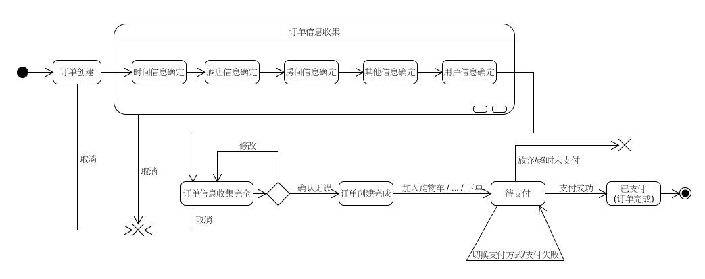
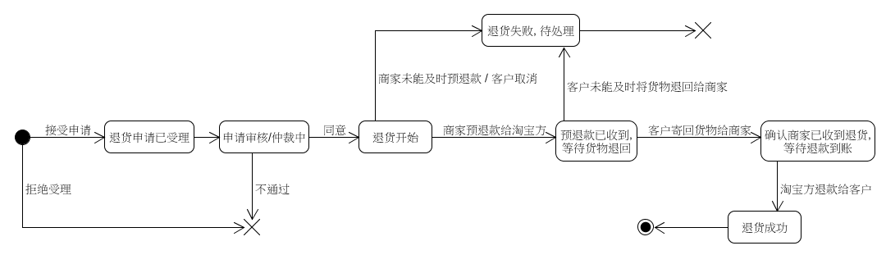

第六次作业 (对应 *lesson8.html*)
============

---

### 1）使用 UML State Model
> - 建模对象： 参考 Asg_RH 文档， 对 Reservation/Order 对象建模。
> - 建模要求： 参考练习不能提供足够信息帮助你对订单对象建模，请参考现在 定旅馆 的旅游网站，尽可能分析围绕订单发生的各种情况，直到订单通过销售事件（柜台销售）结束订单。

---

### 2）研究淘宝退货流程活动图，对退货业务对象状态建模

---

这里的文章除了特别说明为 [转载] 之外，均为本人原创，转载请说明出处。

