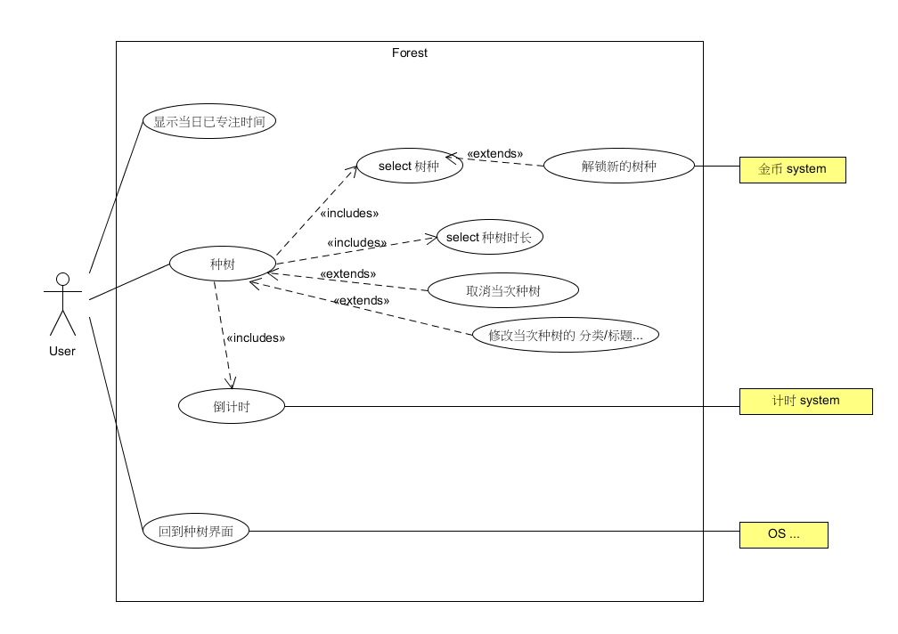
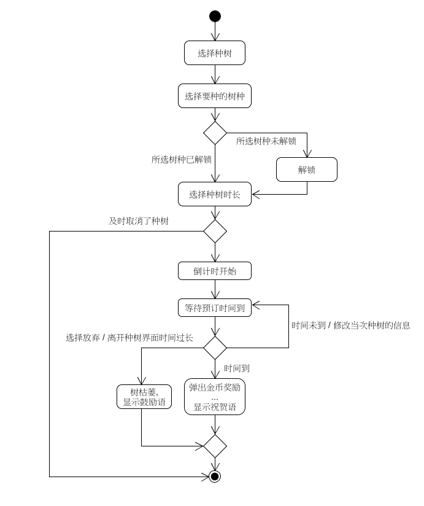
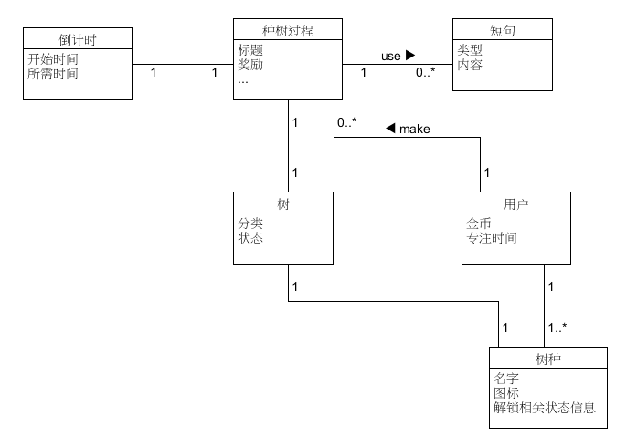
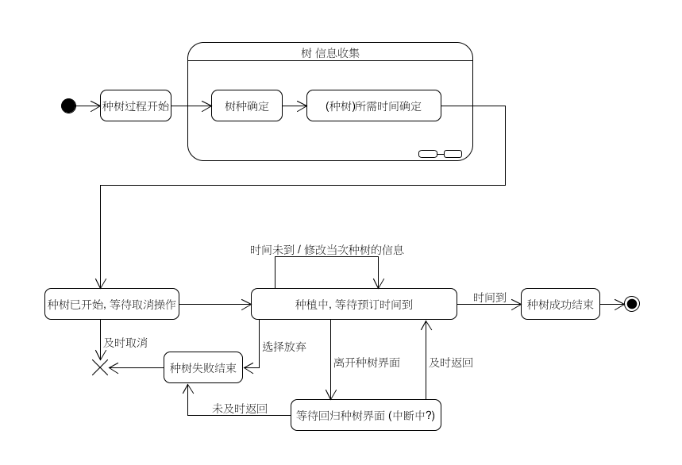

第七次作业 (对应 *lesson9.html*)
============

---

##### 说明

我选择的是:
[Owl Movies Ticket System 项目组的题目](https://github.com/Owl-Movies-Ticket-System/Dashboard/blob/gh-pages/XX1-Forest应用.pdf)

是关于 一个种树应用 Forest 的 ;

---

### 用例图

---

### XX业务或用例的活动图

**种树业务**:

---

### XX领域模型

**种树业务**:

---

### XX对象的状态图

**种树业务** 对象:

---

### XX场景的系统顺序图与操作协议

**种树业务 简单成功 (没有 解锁/取消/放弃 等情况发生)** 场景:
.png)

---

这里的文章除了特别说明为 [转载] 之外，均为本人原创，转载请说明出处。

