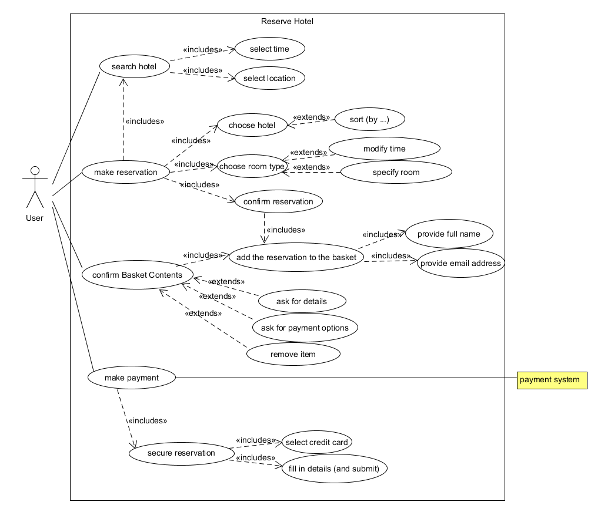
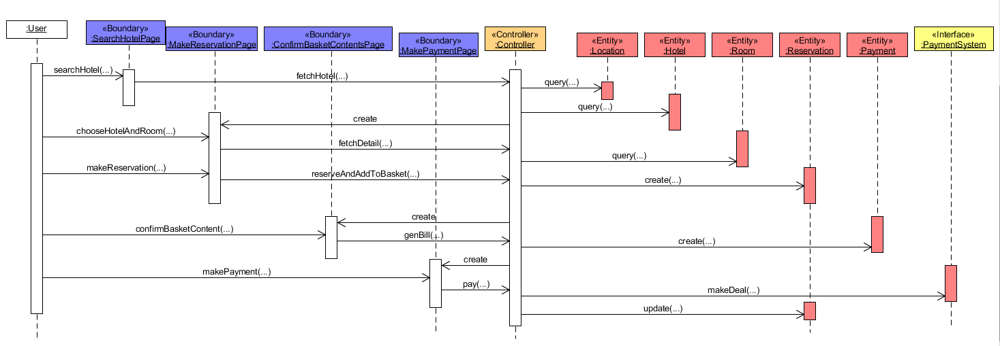
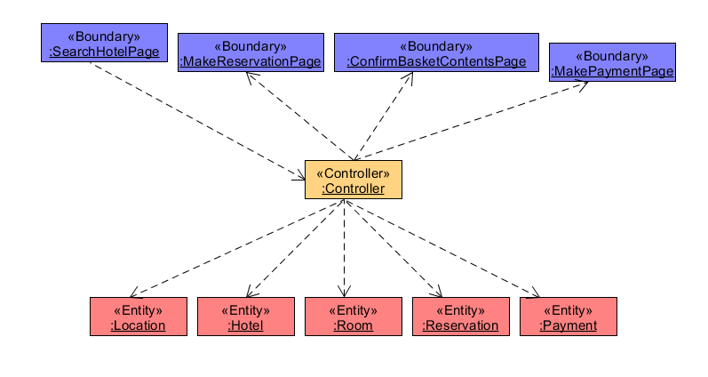
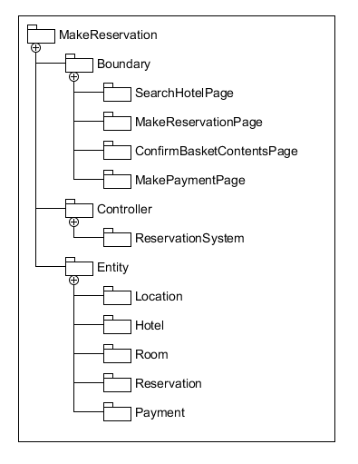

第九次作业 (对应 *lesson16.html*)

---

###### 说明

这个博客模板的 Markdown 渲染好像有点问题 ... 好像还不如 [Github 的渲染结果](https://github.com/Binly42/Binly42.github.io/blob/master/_posts/2018-06-29-System-Analysis-And-Design-Homework.09.md) ...

---

### 使用 ECB 实现 make reservation 用例的详细设计（包含用例简介，顺序图，类图）

参考 [第四次作业](./2018-04-22-System-Analysis-And-Design-Homework.04.md) 和 [第五次作业](./2018-04-29-System-Analysis-And-Design-Homework.05.md), 以及其他同学的优秀作业

#### 用例简介

可作出 make reservation 用例的用例图如下:

从尽量简单的角度出发, 进行设计作图时会作简化, 不考虑一些具体行为 ...

#### 顺序图

#### 类图

---

### 将逻辑设计类图映射到实际项目框架的包图。用树形结构表述实现的包和类

最单纯的按模块进行划分的那种结构:

---

这里的文章除了特别说明为 [转载] 之外，均为本人原创，转载请说明出处。

